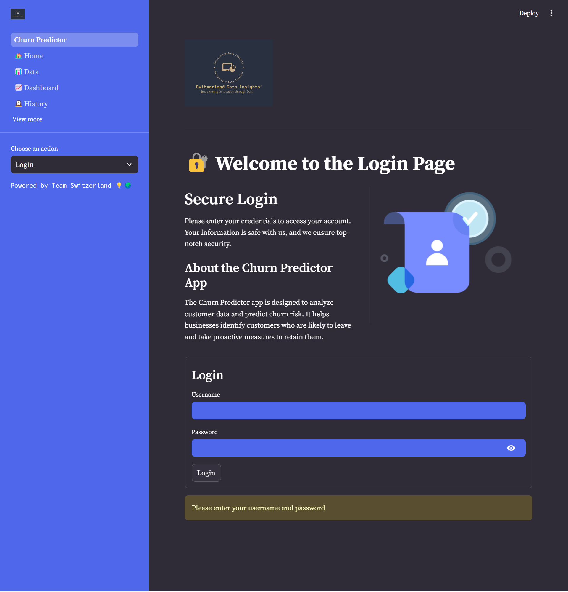
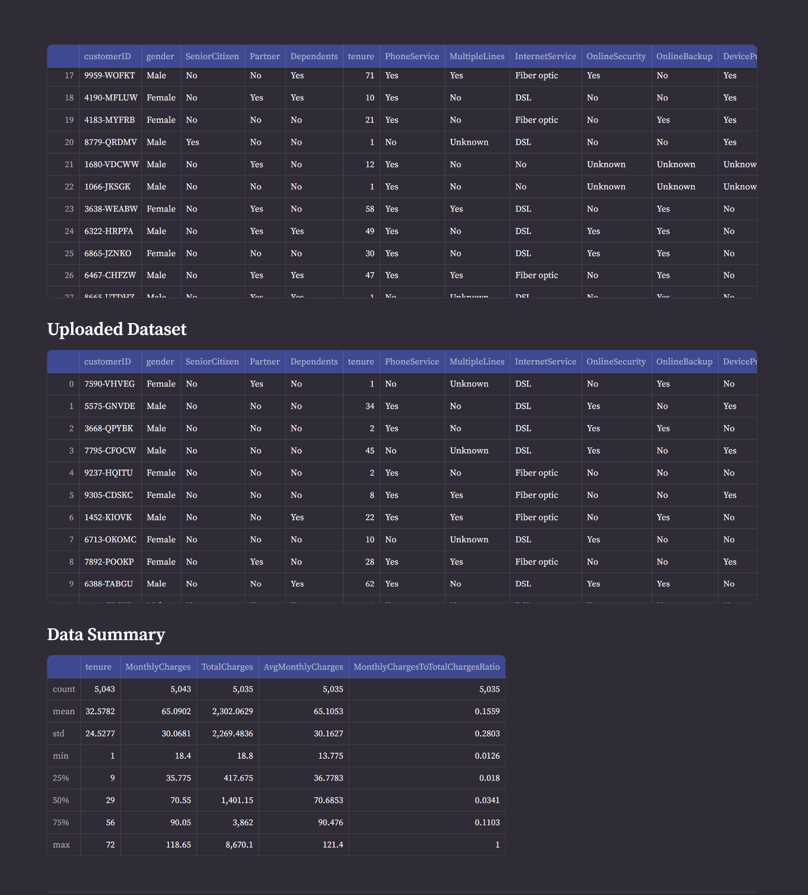
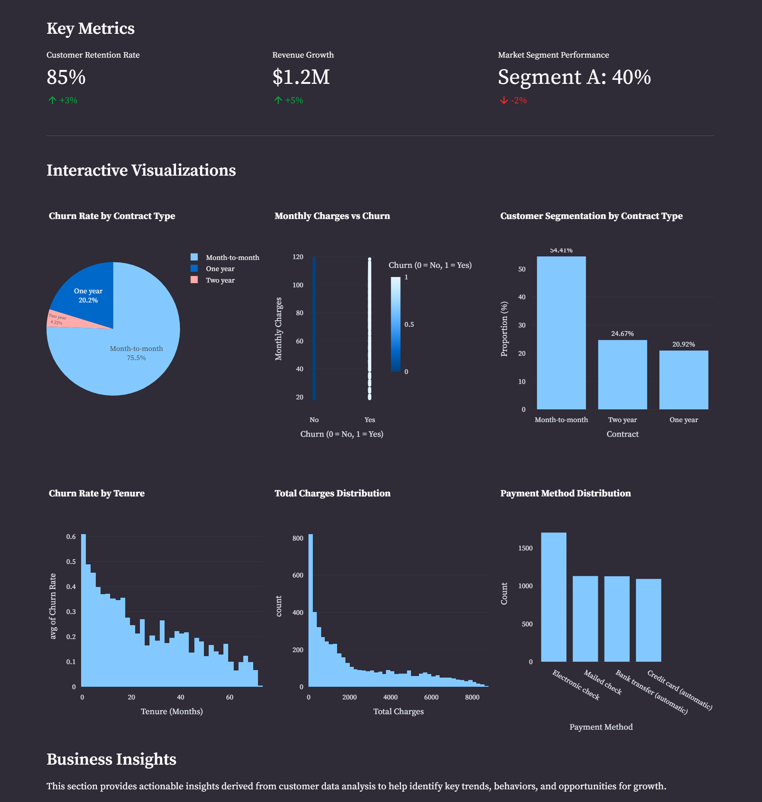
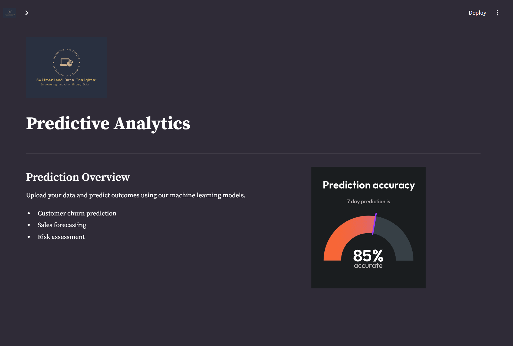
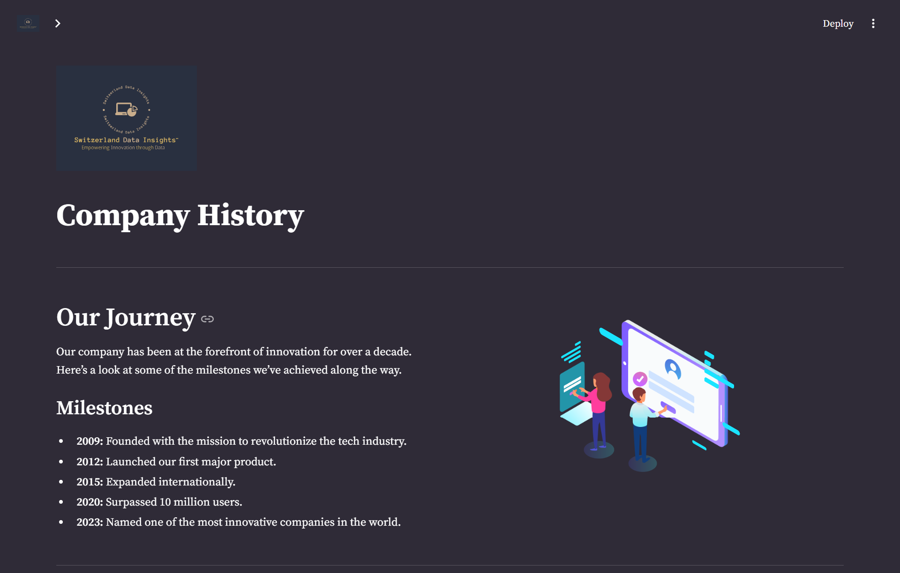

</img>

# **CHURN PREDICTOR**

**A powerful machine learning-based application to predict customer churn for telco companies.**

## Table of Contents
- [**CHURN PREDICTOR**](#churn-predictor)
  - [Table of Contents](#table-of-contents)
  - [Introduction](#introduction)
  - [App Features](#app-features)
    - [Key Features](#key-features)
    - [User Benefits](#user-benefits)
  - [Demo](#demo)
    - [Watch Demo Video](#watch-demo-video)
  - [Installation](#installation)
    - [How to Run the Application](#how-to-run-the-application)
  - [Usage](#usage)
    - [Screenshots](#screenshots)
  - [Machine Learning Integration](#machine-learning-integration)
  - [App Structure](#app-structure)
  - [Contact Information](#contact-information)
    - [Need Help?](#need-help)
  - [Meet the Team](#meet-the-team)
    - [Team Members](#team-members)
    - [Our Mission](#our-mission)
  - [Contributing](#contributing)
  - [License](#license)
  - [Development Workflow:](#development-workflow)

## Introduction
The Churn Predictor App is a cutting-edge tool designed for telco companies to accurately predict customer churn using advanced machine learning algorithms. By leveraging historical data, this app helps businesses retain customers by identifying those at risk of churning and enabling targeted retention strategies.

## App Features

### Key Features
- **Accurate Predictions**: Utilizes state-of-the-art machine learning models to predict customer churn.
- **User-Friendly Interface**: Easy-to-navigate interface designed for both technical and non-technical users.
- **Real-Time Insights**: Provides instant feedback on customer churn risk.
- **Customizable Features**: Allows integration with various data sources and model parameters.

### User Benefits
- **Data-Driven Decisions**: Empowers businesses to make informed decisions based on predictive analytics.
- **Easy Machine Learning Integration**: Seamlessly integrates with your existing data infrastructure.
- **Enhanced Customer Retention**: Enables proactive measures to reduce churn and increase customer loyalty.

## Demo
### Watch Demo Video
[Watch the demo video](https://www.youtube.com/watch?v=8lGpZkjnkt4) to see the Churn Predictor App in action and learn how to maximize its potential.

## Installation

### How to Run the Application
To run the Churn Predictor App locally, follow these steps:

1. Clone the repository:
   ```bash
   git clone https://github.com/Nfayem/Churn_Predictor.git
   cd Churn_Predictor
   ```
2. Install the necessary packages:
   ```bash
   pip install -r LP4_STAPP_requirements.txt
   ```
3. Run the Streamlit app:
   ```bash
   streamlit run Churn_Predictor.py
   ```

For a smooth setup, ensure all dependencies are correctly installed.

## Usage
Once installed, the app can be accessed via your web browser at `http://localhost:8501`. The homepage provides an overview of the app and the the team of developers behind its production. A history page is available to provide an overview of your current data and churn predictions.

### Screenshots
<table>
  <tr>
    <td>
      <h4>Welcome Page</h4>
      
    </td>
    <td>
      <h4>Home Page</h4>
      
    </td>
  </tr>
  <tr>
    <td>
      <h4>Data Management</h4>
            
    </td>
    <td>
      <h4>Dashboard Overview</h4>
            
    </td>
  </tr>
  <tr>
    <td>
      <h4>Prediction Results</h4>
      
    </td>
    <td>
      <h4>History Page</h4>
      
    </td>
  </tr>
</table>

## Machine Learning Integration
The Churn Predictor App uses powerful machine learning models like Random Forest, XGBoost, and Logistic Regression to predict churn. The models have been fine-tuned for accuracy, and the app provides probability estimates for each prediction, allowing businesses to prioritize retention efforts.

## App Structure
The app is organized into several key sections:

1. **User Interaction**: 
   - This section contains pages focused on user engagement and access, including the home page and login functionality. It serves as the gateway for users to interact with the platform. Details of the app features are included here as well.

2. **Data Management**:
   - This section houses tools for managing and analyzing data. It includes pages that provide an overview of the data and visualizations through an analytics dashboard. It’s where users can access and manipulate the core data.

3. **Insights and Forecasting**:
   - This section is dedicated to generating insights from historical data and predicting future trends. It includes pages focused on exploring historical data and making projections based on that data.

## Contact Information
### Need Help?
For support, collaboration, or any inquiries, please contact us at:
- **Email**: [sdi@azubiafrica.com](mailto:sdi@azubiafrica.com)
- **GitHub**: [Churn Predictor App Repository](https://github.com/Nfayem/Churn_Predictor.git)

## Meet the Team
We are a dedicated team of data science professionals from the Azubi-Africa Data Analytics Program, working together to deliver impactful insights through the Churn Predictor App.

### Team Members
|  |  |  |
|:-----------------------------------------------------------------------------:|:---------------------------------------------------------------------------------------:|:--------------------------------------------------------------------------------------:|
| **Nfayem Imoro**                                                              | **Gabriel Koku Kuma**                                                                    | **Jackline Wangari Maina**                                                             |
| Lead Analyst & Project Manager                                                     | Data Engineer & Modeling Expert                                                          | Machine Learning Specialist                                                            |

|  |  |  |
|:---------------------------------------------------------------------------------:|:-----------------------------------------------------------------------------------------:|:------------------------------------------------------------------------------------:|
| **Obed Korda**                                                                    | **Godfred Frank Aning**                                                                    | **Victor Obondo**                                                                    |
| Customer Churn Analyst                                                            | Data Visualization Specialist                                                              | Database Manager                                                                     |

### Our Mission
We aim to drive insights and impact through collaborative projects and cutting-edge analytics. Join us in leveraging data for meaningful advancements! 🌍📈


## Contributing
We welcome contributions from the community! Please read our [Contributing Guide](https://github.com/Nfayem/Churn_Predictor/blob/DevOps/CONTRIBUTING.md) for more information on how to get involved.


## License
This project is licensed under the MIT License - see the [LICENSE](https://github.com/Nfayem/Churn_Predictor/blob/DevOps/LICENSE) file for details.

## Development Workflow:

1. **Local Development**:
   - Develop and test Streamlit app locally.
   - Ensure that all features work as expected.
   - Fix any bugs or issues that arise during development.

2. **Containerization**:
   - Create a `Dockerfile` to define app’s environment and dependencies.
   - Build the Docker image and test it locally to ensure that it works in the containerized environment.
   - Use Docker Compose if needed to manage complex setups with multiple services.

3. **Deployment**:
   - Push the Docker image to a container registry (e.g., Docker Hub).
   - Deploy the containerized app to a production environment or cloud service.

4. **Testing**:
   - Test the containerized app in staging or a test environment to ensure it behaves as expected before production deployment.

---


